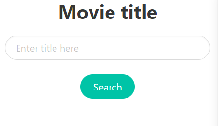

# Stream-Searcher
Click [here]() for the deployed application.

## Introduction
This application shows general information, and streaming services about movies that can be inputted by an user. It saves any searched movies in the localStorage
of the browser and displays them upon page load. 

## Techonologies used
- HTML
- CSS, Bulma
- JavaScript
- Watchmode API
- IMDb API

## Function
- The user can search for a movie in the search bar. The input is a string.

 

 - Validate the search:
   - If the string is empty, show an error in modal.
   - If the string is not a valid movie name, show an error in modal.
- Use Fetch methods to get the movie information.
- The user is presented, in a modal, with a list of movies whose names matches the user input.
- The user can click on the appropriate movie name, and a poster and general information about the movies will be displayed.
- This part of the site is styled to fade in from both sides.

- The left side of the page is dedicated to displaying the movie poster and general information.
  - Movie poster:
    - An image of the title.
  - General information:
    - Type, release date, age rating, genre, user rating, critic score.
    - Plot overview is only shown if the user clicks on the plot overview button.
- A trailer of the movie is embedded at the bottom of general movie information.

- A search history is kept on the right of trailer. The user can click on the movie names in the search bar to view its information. The search history also contains
a clear button that clears all the previous searches.

- At the buttom of the page, a list of streaming services for the movie is displayed.

- The user can click on those service icons and they will be redirected to the corresponding service website in a new tab.
- The icons are animated upon mouse hover. 

  
